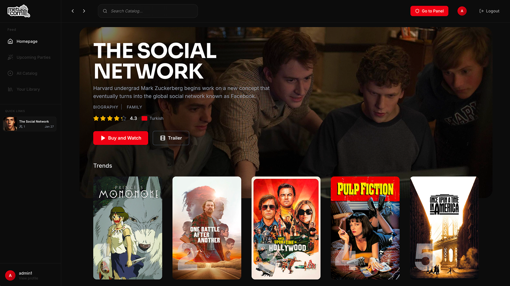

import PhotoGallery from "../../components/blog/PhotoGallery.astro";
import imgHeader from "../../assets/metucorn-project-header.png";
import imgOpening from "../../assets/metucorn/metucorn-opening.png";
import imgOpening1 from "../../assets/metucorn/metucorn-opening1.png";
import imgOpening2 from "../../assets/metucorn/metucorn-opening2.png";
import imgOpening3 from "../../assets/metucorn/metucorn-opening3.png";
import imgOpening4 from "../../assets/metucorn/metucorn-opening4.png";
import imgOpening5 from "../../assets/metucorn/metucorn-opening5.png";
import imgOpening6 from "../../assets/metucorn/metucorn-opening6.png";
import imgOpening7 from "../../assets/metucorn/metucorn-opening7.png";
import imgOpening8 from "../../assets/metucorn/metucorn-opening8.png";

## Useful Links

- Final Report: [drive-report](https://drive.google.com/file/d/1UXni5-UBzVCdbYFx1bs_C8PtMHS1K6Ln/view?usp=sharing)
- Demo Links: [custom-domain](https://metucorn.tech), [vercel-domain](https://metucorn-movie.vercel.app)
- Source Codes: [github](https://github.com/busahinku/metucorn)

## Overview

metucorn is a movie watching and physical ticket platform designed to bring the shared viewing experience online and physical 
cinemas at the same time. "New generational media but not controlled by the five major families :D (!)" It allows users to browse an 
extensive movie catalog, purchase tickets, and host synchronized watch parties with friends. The platform solves the challenge 
of remote movie nights by ensuring that everyone in the party sees the exact same frame at the same time, managed by the host.

<PhotoGallery
  images={[
    {
      src: imgOpening1,
      alt: "",
      caption: "",
    },
    { src: imgOpening2, alt: "", caption: "" },
    { src: imgOpening3, alt: "", caption: "" },
    { src: imgOpening4, alt: "", caption: "" },
    { src: imgOpening5, alt: "", caption: "" },
    { src: imgOpening6, alt: "", caption: "" },
    { src: imgOpening7, alt: "", caption: "" },
    { src: imgOpening8, alt: "", caption: "" },
  ]}
  columns={4}
/>

## Features

### User Experience

- **Watch Parties**: Create and join synchronized movie watching sessions. The host controls playback (play/pause, seek), ensuring a unified experience for all participants.
- **Movie Catalog**: A rich interface to browse and search for movies, complete with details like ratings, genres, directors, and cast.
- **Ticket System**: Secure purchasing flow that generates unique QR codes for access validation. It allows you to watch movie at theatre once.
- **Interactive Reviews**: Users can rate and review movies, contributing to the community feedback loop.
- **User Profiles**: Personal dashboard to manage account details and view ticket history.

### Admin Capabilities

- **Content Management**: Full control to add, edit, or remove movies from the catalog.
- **User & Party Management**: Tools to monitor userbase and active watch parties.
- **Analytics Dashboard**: Comprehensive charts and statistics to track platform usage and engagement.
- **Moderation**: Ability to moderate user reviews and ratings to maintain community standards.

## Tech Stack

The project is built on a modern, robust stack ensuring visual perfectionism:

- **Frontend**: Next.js 14, React 18, TypeScript for type safety.
- **Styling**: Tailwind CSS for a sleek, responsive design.
- **Backend & Database**: PostgreSQL via Supabase. And, its powerful Auth and Database features.
- **Real-time**: Supabase Realtime for synchronizing watch party states.
- **Authentication**: Supabase Auth with Google OAuth integration.
- **Utilities**: React Player for video handling, Recharts for analytics, and qrcode.react for ticket generation.
