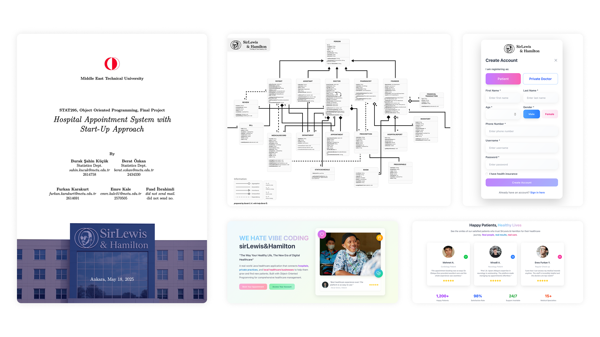
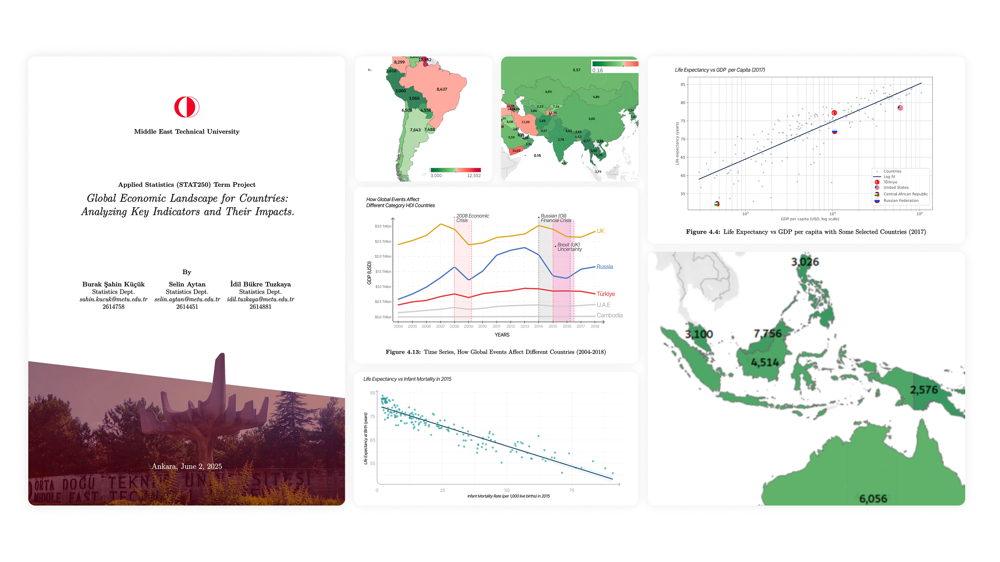
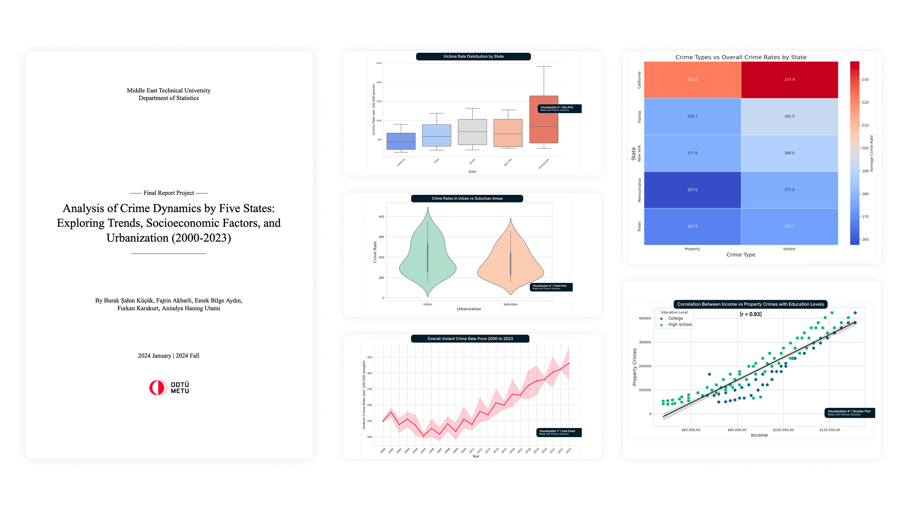
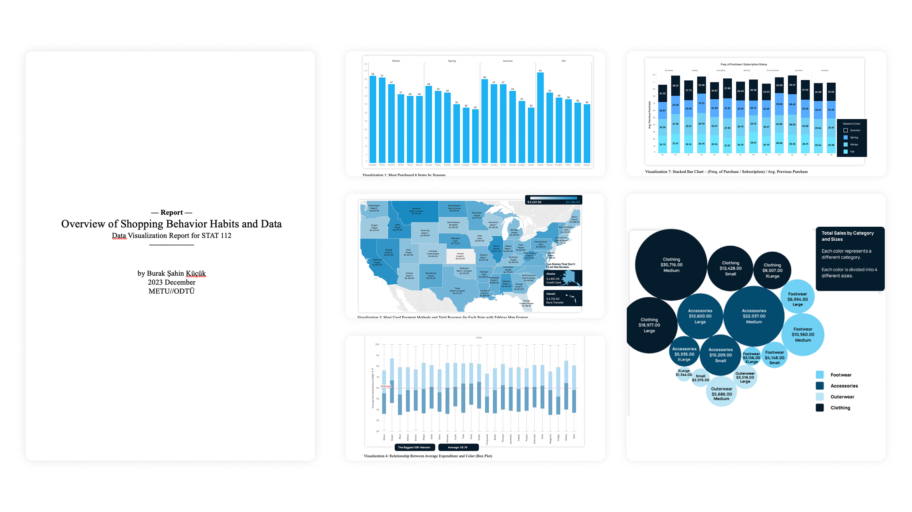

## Overview

This page contains a collection of my academic reports from various statistics courses during my studies at Middle East Technical University (METU). Each report demonstrates different statistical concepts, methodologies, and practical applications.

---

## STAT 365

{/* Add your image here */}

**Report Link:** [View on Google Drive](https://drive.google.com/file/d/17Q5wTo7mughH09RYWrM3Z8PnApKyncFD/view?usp=sharing)

This study has revealed the difficulties encountered by 
Middle East Technical University (METU) students in their academic 
planning and course registration processes, the causes of their 
stress, and their need for digital academic counseling tools through a 
survey. The findings revealed that stress experienced during the 
registration process was prevalent across all grade levels and did not decrease with seniority (Mann-Whitney U test, p = 0.402). 
It was found that 41% of students felt ”very stressed and overwhelmed” or ”confused and lost” during the registration period. 
Academic workload (28.2%), financial anxieties (16.5%), and post-graduation uncertainty (15.0%) were identified as the main 
sources of stress. Chi-square tests showed that Probation students experienced significantly more financial anxiety than other 
GPA groups (z=+3.84, p¡0.001). Career clarity was observed to peak in junior year and then decline in senior and graduate students. 
Sentiment analysis of open-ended responses showed that 59.1% of feedback was positive and 31.8% was neutral, and thematic analysis 
revealed that student concerns were predominantly focused on System/Platform (50.0%) and Course Planning (36.4%). The study 
highlights the potential of digital academic counseling platforms like metuans.com to respond to student needs, while emphasizing 
the necessity of multifaceted approaches in addressing institutional and socio-economic problems.

---

## STAT 311

{/* Add your image here */}

**Report Link:** [View on Google Drive](https://drive.google.com/file/d/1UXni5-UBzVCdbYFx1bs_C8PtMHS1K6Ln/view?usp=sharing)

This project presents metucorn, a comprehensive, database-driven movie watch party platform developed as part of the STAT311 Modern Database Systems course. The system demonstrates database concepts through a web application built using PostgreSQL (via Supabase), Next.js 14 and React 18. The database 
architecture consists of 14 tables that manage the complex relationships between users, movies, tickets, viewing parties, and ratings. The application supports user authentication (email/password and OAuth), movie catalog browsing, ticket purchasing, creating and joining synchronized viewing parties, movie rating and commenting, viewing history tracking, and a comprehensive admin panel for content management and analysis. The entire system was deployed using a zero-cost architecture: Vercel for front-end hosting and Supabase for a managed PostgreSQL database, demonstrating real-world cloud deployment applications.

---

## STAT 295

{/* Add your image here */}

**Report Link:** [View on Google Drive](https://drive.google.com/file/d/1s2dCleDkFFoLfKFl-IzgaBUIoPWdDpX4/view?usp=sharing)

In this project, our hospital-based startup's appointment and evaluation system is designed. The system
allows users to book doctor appointments and perform evaluations. Also, doctors can view and manage
patients' evaluations. Founder can generate hospital & start-up report.

---

## STAT 250

{/* Add your image here */}

**Report Link:** [View on Google Drive](https://drive.google.com/file/d/14w-2mMoMO0vdi02hKJp2tl-5lmr9cVtw/view?usp=sharing)

In order to analyze the world's economic and countries' growth situation from the years 2004 to 2017
based on the major development indicators i.e., GDP, life expectancy, Human Development Index (HDI),
Infant Mortality Rate, Income Groups, Gender, etc. And their relationships and effects on one another.
The research further intends to reveal Türkiye's position and trajectory in these indicators.

---

## STAT 112 - Final Project

{/* Add your image here */}

**Report Link:** [View on Google Docs](https://docs.google.com/document/d/1fjiru0pNxAimnGnyBBsc_hgtSoxoK5so/edit?usp=sharing&ouid=117838242683814174498&rtpof=true&sd=true)

This research study examines crime statistics from numerous states, concentrating on the relationship between crime rates and socioeconomic factors such as income, education, and urbanization. A dataset of 120 inputs is evaluated to identify trends and draw relevant conclusions that can potentially inform policy decisions. The research study sheds light on the links and correlations of crime dynamics through thorough data cleaning and the use of various visualization approaches. The study includes explicit findings on the distribution of crime rates between urban and suburban areas, the impact of income on property crime in connection to education levels, and a comparison of crime types by state. The findings highlight the intricate relationship between socioeconomic conditions and crime and provide a qualitative view of regional crime trends.

---

## STAT 112 - Term Project

{/* Add your image here */}

**Report Link:** [View on Google Docs](https://docs.google.com/document/d/1eITgmF28Fo7sfCxB0WpGV8b5Jo-_rAxo/edit?usp=sharing&ouid=117838242683814174498&rtpof=true&sd=true)

The first rule of being better is this: customers must be well-known to sell more and compete with competitors. To match this competitive environment, users' data must be collected. This report used data from user transactions from a nationwide shopping company. The data ranges from some personal characteristics to the different categories of products sold by the market. The main aim of this report is to visualize the data effectively to understand how the shopping company could be better.

---

Each report represents coursework completed as part of my Statistics curriculum at METU. And it shows my growth and understanding of statistical analysis and research methodologies over time.
